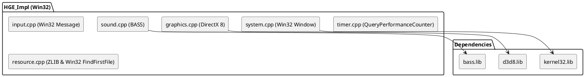
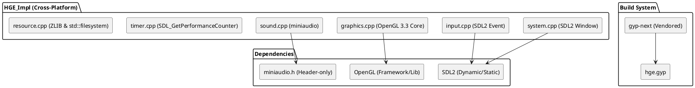

# Spec: HGE 引擎跨平台与 macOS 重构方案

## 1. 背景与目标 (Background & Objectives)

### 1.1 背景
HGE (Haaf's Game Engine) 是一款经典的 2D 硬件加速游戏引擎，但其底层强绑定于 Windows 平台（DirectX 8, BASS 音频库, Win32 API）。随着时代发展，许多开发者和玩家希望在 macOS 等现代跨平台操作系统上运行基于 HGE 开发的经典游戏。

### 1.2 业务目标
- 将 HGE 的底层实现重构为跨平台架构，使其能够原生运行于 macOS（及其他支持的类 Unix 系统 / Windows）。
- 替换闭源且具有商业授权限制的 BASS 音频库为合适的开源音频库。
- 使用 GYP 作为跨平台构建系统，并且内置工具以确保环境一致性。

### 1.3 涉众目标 (User / Stakeholder Objectives)
- **游戏开发者**: 能够以几乎“零修改”或“极小修改”（仅替换 `HWND` 为 `HGE_HWND`）的代价，将旧有的 HGE 游戏项目在 macOS 上重新编译和发布。
- **最终玩家**: 在 macOS 上获得与原版一致的高性能游戏体验。

## 2. 需求类型概览 (Requirement Type Overview)

| Type (类型) | Applicable | Evidence (Source) |
| :--- | :---: | :--- |
| Business (业务) | Yes | “解出整个大的架构，然后我要进行重构，变成跨平台（尤其是 macOS）可用的” |
| User/Stakeholder (涉众) | Yes | “最终 HGE 的 API 得不变”，“用 HGE_HWND 吧” |
| Solution (解决方案) | Yes | 采用 SDL2 + OpenGL 3.3 + miniaudio 的技术栈，使用内置的 **gyp-next** 构建 |
| Functional (功能) | Yes | 第 3 节：图形、音频、文件系统、输入的核心能力替换 |
| Nonfunctional (非功能) | Yes | “按高性能来做” (NFR-001) |
| External Interface (外部接口) | Yes | 保持 `hge.h` 公开接口稳定 |
| Transition (过渡/迁移) | Yes | Win32 类型的 mock 与路径自适应处理 |

## 3. 功能需求 (Functional Requirements)

### FR-001: 跨平台窗口与系统上下文管理
- **描述**: 系统必须使用 SDL2 替换原有的 Win32 API (`CreateWindowEx`, 消息循环等) 来管理窗口生命周期和系统事件。
- **验收标准**:
  - `System_Initiate` 和 `System_Start` 能够成功在 macOS 上创建窗口并进入主循环。
  - 原有使用 `HWND` 的地方（如 `System_GetState(HGE_HWND)`）应返回统一封装的 `HGE_HWND`。
- **优先级**: Must
- **类型映射**: Functional / Solution

### FR-002: 对标 DirectX 的跨平台图形渲染
- **描述**: 系统必须使用 OpenGL 3.3 (Core Profile) 替换原有的 DirectX 8，实现与 DX 对标的硬件加速渲染。
- **验收标准**:
  - 实现 `Gfx_RenderQuad`, `Gfx_RenderTriple`, `Gfx_RenderLine`。
  - 完整实现原有的 Batch 渲染逻辑 (`Gfx_StartBatch`, `Gfx_FinishBatch`)。
  - 材质状态和混合模式（如 `BLEND_ALPHABLEND`, `BLEND_COLORADD`）在 OpenGL 中正确映射。
- **优先级**: Must
- **类型映射**: Functional

### FR-003: 开源音频子系统
- **描述**: 系统必须使用跨平台的开源音频库（推荐 **miniaudio**）完全替换现有的 BASS 音频库。
- **验收标准**:
  - `Effect_Load`, `Effect_Play`, `Music_Load`, `Music_Play` API 行为与原版一致。
  - 支持音量控制、声相 (Panning) 和音调 (Pitch) 调节。
- **优先级**: Must
- **类型映射**: Functional

### FR-004: 跨平台文件路径适配层
- **描述**: 系统必须在 `Resource_Load` 等涉及文件 IO 的地方，自动处理跨平台路径差异。
- **验收标准**:
  - 自动将 Windows 风格的反斜杠 `\` 转换为正斜杠 `/`。
  - 能够处理 macOS 文件系统的大小写敏感问题（必要时通过目录遍历进行不区分大小写的匹配）。
- **优先级**: Must
- **类型映射**: Functional / Transition

### FR-005: 跨平台输入处理
- **描述**: 系统必须使用 SDL2 的事件系统重写键盘和鼠标输入的获取。
- **验收标准**:
  - `Input_GetKeyState`, `Input_GetMousePos` 及事件队列 `hgeInputEvent` 的逻辑表现与 Win32 消息一致。
- **优先级**: Must
- **类型映射**: Functional

### FR-006: 保留 ZLIB 资源包支持
- **描述**: 系统必须继续支持从 `.res` 等 ZIP 格式压缩包中加载资源。
- **验收标准**:
  - `Resource_AttachPack` 能够正常挂载压缩包。
  - `Resource_Load` 能够从已挂载的压缩包中提取数据。
  - ZLIB 源码随引擎一同使用 GYP 编译。
- **优先级**: Must
- **类型映射**: Functional

## 4. 非功能需求 (Nonfunctional Requirements)

### NFR-001: 渲染与纹理操作高性能 (High Performance)
- **描述**: 渲染管线与动态纹理更新必须针对高性能进行优化，不能因为跨平台封装而产生明显的性能回退。
- **测量方式**: 
  - `Texture_Lock` 和 `Texture_Unlock` 必须使用高效的图形 API 机制（如 OpenGL 的 Pixel Buffer Object, PBO 或 `glTexSubImage2D` 配合客户端内存池），以避免阻塞 CPU/GPU 同步。
  - `Gfx_Render*` 必须继续维持原有的批处理 (Batching) 机制，使用 VBO 动态更新顶点数据。
- **优先级**: Must
- **来源**: 用户要求“按高性能来做”

### NFR-002: API 零侵入 / 低侵入
- **描述**: 游戏层业务代码不应感知到底层是 OpenGL 还是 SDL。
- **测量方式**: 包含 `hge.h` 并重新编译旧代码时，除了将 `HWND` 修改为 `HGE_HWND` 外，不需要修改函数调用签名。
- **优先级**: Must

## 5. 外部接口需求 (External Interface Requirements)

### IF-001: HGE 公开头文件 (`hge.h`) 净化
- **类型**: C++ API
- **处理方式**: 
  - 移除强制包含的 `<windows.h>`。
  - 使用 `<stdint.h>` 定义 `DWORD` (uint32_t), `WORD` (uint16_t), `BYTE` (uint8_t) 以保持兼容。
  - 定义 `typedef void* HGE_HWND;`。

## 6. 过渡需求 (Transition Requirements)

### TR-001: 路径与资源加载自适应
- **描述**: 旧代码通常硬编码了如 `Texture_Load("images\\hero.png")`。
- **策略**: 在底层的资源管理器中实现一个 Path Resolver。当请求加载文件时，先执行 `\` 到 `/` 的替换；若文件未找到，利用 C++17 `std::filesystem` 扫描同级目录，进行忽略大小写的名称匹配并加载。

## 7. 约束与假设 (Constraints & Assumptions)

### 7.1 技术约束
- 必须支持 macOS 原生编译。
- 构建系统 **必须使用 GYP (基于 `gyp-next`)**，且工具本身需内置在源码目录中。
- 不引入极其庞大或难以编译的第三方库，保持 HGE 小巧轻量的特色。

### 7.2 假设
- **假设**: 绝大部分 HGE 游戏使用的是 2D 正交投影和固定功能/基础的 Shader。使用 OpenGL 3.3 Core Profile 并编写一个通用的 2D Shader 能够完全覆盖 D3D8 的默认渲染行为。
- **来源**: 基于 HGE 源码 (`hge_impl.h` 和 D3D8 渲染逻辑) 的推断。

## 8. 优先级与里程碑建议 (Priorities & Milestone Suggestions)

| ID | Requirement | Priority | Reason |
| :--- | :--- | :--- | :--- |
| FR-001/005 | 系统与输入 (SDL2) | Must | 引擎的基础上下文，没有它无法测试渲染 |
| FR-002 | 图形渲染 (OpenGL 3.3) | Must | 核心痛点，DX8 替换，实现难度最大 |
| FR-004 | 路径适配 | Must | 否则无法在 macOS 加载任何测试资源 |
| FR-003 | 音频子系统 (miniaudio) | Should | 可以稍后实现，不阻塞画面呈现 |

- **里程碑 1**: 工具链准备与基础框架（下载并内置 `gyp-next`，完成 `hge.gyp` 编写，系统上下文、事件循环跑通）。
- **里程碑 2**: 渲染管线（OpenGL 3.3 渲染管线、纹理与资源加载机制跑通，能在 macOS 上显示画面）。
- **里程碑 3**: 音频与完善 (集成 miniaudio，实现所有遗漏的 API，完成性能优化，跑通原版 Demo)。

## 9. 架构设计提案 (RFC: Change / Design Proposal)

### 9.1 As-Is 分析 (当前架构)

- **当前痛点**: D3D8 仅限老旧 Windows；BASS 有商业授权限制；`<windows.h>` 污染了全局命名空间，导致无法在 POSIX 系统编译。没有现代的跨平台构建工具支持。

### 9.2 Target State (目标架构)

- **目标架构**: 
  - **构建系统**: **gyp-next** (`https://github.com/nodejs/gyp-next`)。该工具源码将直接下载并放置于项目目录中（如 `tools/gyp`），编写 `.gyp` 文件统一管理源文件和平台特定的编译选项。
  - **窗口/输入/定时器**: **SDL2**。
  - **图形**: **OpenGL 3.3 Core Profile**。
  - **音频**: **miniaudio** (单头文件库)。
- **关键变更**: 
  - `HGE_Impl` 类中的 `IDirect3D*` 成员替换为 OpenGL 的 `GLuint`。
  - BASS 相关句柄替换为 miniaudio 的 `ma_sound`, `ma_engine` 句柄。

### 9.3 详细设计 (Detailed Design)

- **构建设计 (gyp-next 集成)**:
  - 在项目根目录执行 `git clone https://github.com/nodejs/gyp-next tools/gyp`，将 GYP 引擎 Vendor 进项目。
  - 编写 `hge.gyp`。定义 target `hge` (静态库/动态库)，并在 `sources` 中包含 `src/core/*.cpp` 以及 `ZLIB/*.c`。
- **模块设计**:
  - **Core**: 将 Win32 API (`PeekMessage`, `QueryPerformanceCounter` 等) 替换为对应的 `SDL_PollEvent`, `SDL_GetPerformanceCounter`。
  - **Graphics**: 重写 `graphics.cpp`。初始化时创建 SDL_GL_Context。实现一个默认的 2D Shader 替代 DX8 的 Fixed Pipeline。
  - **Texture**: 针对高性能 Texture_Lock，在内存中维护一份 `std::vector<uint8_t>` 作为 backing store，`Texture_Lock` 返回该内存指针；`Texture_Unlock` 时，通过 `glTexSubImage2D` 上传。
  - **Audio**: 使用 `ma_engine_init` 初始化，加载音频使用 `ma_sound_init_from_file`。
  - **Resource**: 保留 `unzip` 和 `ZLIB` 的逻辑，修改路径拼装以支持跨平台。

### 9.4 替代方案考虑 (Alternatives Considered)

| Option | Pros | Cons | Decision |
| :--- | :--- | :--- | :--- |
| **构建: gyp-next (内置)** | 兼容 Python 3，内置确保环境一致性，用户指定 | 增加了一定量的源码体积 | **Selected** (最佳兼容性与用户要求) |
| **图形: OpenGL 3.3** | 与 DX 对标，跨平台支持好，非常适合 2D 批处理 | 苹果已弃用 (但仍可用) | **Selected** (最符合“对标DX”与轻量化要求) |
| **音频: miniaudio** | 纯 C 单头文件，零依赖，跨平台，高性能 | API 相对较底层 | **Selected** |

### 9.5 实施与迁移计划 (Implementation Plan)

- **实施顺序**:
  1. 下载并内置 `gyp-next` 源码到 `tools/gyp` 目录。
  2. 编写 `hge.gyp`，测试执行 `./tools/gyp/gyp --depth=. hge.gyp` 能够正常生成 Xcode 或 Makefile 工程。
  3. 重构 `hge.h` 和基础类型（移除 `<windows.h>`，引入 `HGE_HWND` 等基础类型 mock）。
  4. 实现 System / Window / Input 模块 (SDL2)，编译通过。
  5. 实现 Graphics 模块 (OpenGL 3.3) 和文件系统适配层。
  6. 实现 Audio 模块 (miniaudio)。

## 10. TBD List (待定事项列表)

| ID | Item | Missing Information | Next Step |
| :--- | :--- | :--- | :--- |
| TBD | (无) | 所有先前 TBD 已解决。 | 准备进入开发。 |
