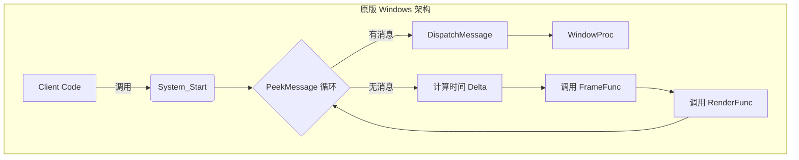
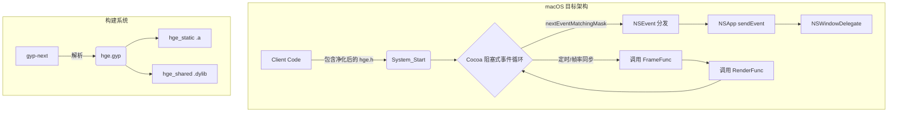

# Spec: HGE 跨平台重构 - 阶段一：系统生命周期与构建基底

## 1. 背景与目标

### 1.1 背景
HGE 引擎依赖于老旧的 Win32 API 和 DirectX 8。为实现向 macOS 平台的平滑移植，必须进行分阶段重构。本阶段作为第一步，旨在建立独立的跨平台构建环境，并在 macOS 上原生接管应用窗口与系统事件循环。

### 1.2 业务目标
- 部署 `gyp-next` 作为跨平台构建工具，同时输出静态库和动态库。
- 净化 `hge.h` 公开接口，剔除 `<windows.h>` 依赖，定义跨平台的基础数据类型。
- 使用 Objective-C++ 和 macOS Cocoa API (`NSApplication`, `NSWindow`) 重写 `System_Initiate`, `System_Start`, `System_Shutdown` 等引擎生命周期方法。

### 1.3 用户/涉众 (Stakeholder) 目标
- 确保开发者最终能够以极小的代价（如将 `HWND` 替换为 `HGE_HWND`）移植项目。
- 在重构初期，提供语义与表现效果一致的 `System_Start` 阻塞循环机制，以便业务逻辑的 `FrameFunc` 和 `RenderFunc` 能够按预期帧率被调用。

## 2. 需求类型概览

| 类型 (Type) | 适用 | 证据/来源 (Source) |
| :--- | :--- | :--- |
| 业务 (Business) | 是 | “解出整个大的架构，然后我要进行重构，变成跨平台” |
| 用户/涉众 (User) | 是 | “不要一步跨太大… 选择好范围再写”、“保证 API 语义一致即可，并且表现效果也一样” |
| 解决方案 (Solution)| 是 | 使用 gyp 构建；使用原生 macOS API (Cocoa) |
| 功能 (Functional) | 是 | 见第 3 节 (构建、窗口、主循环、API 占位) |
| 非功能 (Nonfunctional)| 是 | 见第 4 节 (API 低侵入性) |
| 外部接口 (Interface) | 是 | 见第 5 节 (`hge.h` 头文件净化) |
| 过渡 (Transition) | 否 | “不考虑迁移，就考虑本身所有公开的 API” |

## 3. 功能需求

### FR-001: 跨平台双库构建 (GYP)
- **描述**: 系统必须基于 `gyp-next` 建立工程，同时输出静态库和动态库。
- **验收标准**:
  - `tools/gyp` 目录存放内置的 `gyp-next`。
  - `hge.gyp` 定义 `hge_static` 和 `hge_shared` 两个 target。
- **优先级**: Must
- **来源**: 用户指令（“用 gyp”、“二者都需要，你看 HGE 原版是怎么样的”）

### FR-002: macOS 原生窗口接管
- **描述**: 引擎初始化时必须使用 Cocoa 原生 API 创建窗口。
- **验收标准**:
  - `System_Initiate` 中创建 `NSWindow`。
  - `System_Shutdown` 中安全关闭窗口与应用上下文。
- **优先级**: Must
- **来源**: 用户指令（“用原生 macOS API 吧”）

### FR-003: 帧率同步与阻塞式主循环
- **描述**: `System_Start` 必须实现一个挂起调用的死循环，同时负责分发系统事件与触发用户回调，且表现效果必须与原版一致。
- **验收标准**:
  - 循环内通过 `[NSApp nextEventMatchingMask:...]` 手动泵取（Pump）系统事件。
  - 在循环内部精确控制调用 `FrameFunc` 的时机（结合内部定时器控制帧率，确保 `Update` 的频率正确）。
  - 满足“多少帧率 update 以此然后绘画一次”的语义，并在 `FrameFunc` 返回 `true` 时退出循环。
- **优先级**: Must
- **来源**: 用户指令（“通过你那个什么 nextEvent 也能做到多少多少帧率 update...保证 API 语义一致”）

### FR-004: 非本期 API 的 Stub 占位
- **描述**: `hge.h` 中的所有公开接口（包括但不限于 `Gfx_*`, `Effect_*`, `Resource_*` 等）必须在源文件中保留签名，但暂不提供实际功能。
- **验收标准**:
  - 占位函数必须返回合适的默认值（如 `nullptr`, `0`, `false`）。
  - 占位函数体必须添加 `// TODO: WIP` 标记。
- **优先级**: Must
- **来源**: 用户指令（“先留空返回默认值加 TODO 或者 WIP”）

## 4. 非功能需求

### NFR-001: API 一致性与纯净度
- **描述**: 重构后的底层代码不能污染对外的 C++ 接口，外部代码无需感知 Objective-C++ 的存在。
- **测量**: `hge.h` 内不允许出现任何 Cocoa 特有的对象指针定义，不得 `#import <Cocoa/Cocoa.h>`。

## 5. 外部接口需求

### IF-001: Win32 类型宏替换
- **描述**: 剥离 `<windows.h>`，保障跨平台编译通过。
- **处理方式**: 使用 `<stdint.h>` 定义 `DWORD` (uint32_t), `WORD` (uint16_t), `BYTE` (uint8_t)。将 `HWND` 替换为不透明的 `HGE_HWND` 指针。

## 6. 过渡需求

- 本阶段不涉及遗留资产或向下兼容（TR-N/A）。

## 7. 约束与假设

### 7.1 约束
- **边界约束**: 第一步的开发范围严格锁定在：构建系统、头文件重构、系统级生命周期 (`System_*` 系列方法)。图形渲染与音频等均不在本期实现范围内。
- **语言约束**: 跨平台窗口实现代码必须封装在 `src/core/mac/system_mac.mm` 中以使用 Objective-C++ 编译。

### 7.2 假设
- `gyp-next` 能够被本地 Python 环境正常调用，并且能在 macOS 上顺利生成 Makefile 或 Xcode 工程。

## 8. 优先级与里程碑建议

| ID | 需求 | 优先级 | 理由 |
| :--- | :--- | :--- | :--- |
| FR-001 | 跨平台双库构建 (GYP) | Must | 这是编译的核心基底 |
| IF-001 | Win32 类型宏替换 | Must | 确保 `hge.h` 能够跨平台编译 |
| FR-004 | 非本期 API 的 Stub 占位 | Must | 满足“保留所有公开 API”的要求 |
| FR-002 | macOS 原生窗口接管 | Must | macOS 生命周期的第一步 |
| FR-003 | 帧率同步与阻塞式主循环 | Must | 本期重构的核心难点与技术风险所在 |

## 9. 更改 / 设计提案 (RFC)

### 9.1 As-Is 分析

在原版 HGE 中，引擎的生命周期、窗口管理和消息泵全部耦合在 `system.cpp` 中，且深度依赖 Win32 API。



**当前痛点**：
- `hge.h` 强制包含了 `<windows.h>`，导致其污染了全局命名空间，无法在 POSIX/macOS 环境下编译。
- 原版 `system.cpp` 包含大量不可移植的代码（如 `RegisterClassEx`、`CreateWindowEx`）。
- 原版 HGE 使用传统的 Visual Studio 工程文件 (`.sln`, `.vcproj`)，不支持跨平台构建。

### 9.2 目标状态 (Target State)

目标架构是将 `hge.h` 纯净化，并将平台无关的配置逻辑与平台强相关的生命周期逻辑分离。



**关键变更**：
- 引入 `gyp-next` 作为跨平台构建标准。
- `hge.h` 中的 `DWORD` 等 Win32 类型通过 `<stdint.h>` 重新定义。
- 提取出一个全新的 `mac/system_mac.mm` 文件，专门负责处理 Cocoa 的 Objective-C++ 逻辑。

### 9.3 详细设计 (Detailed Design)

#### 9.3.1 接口层净化 (`hge.h` 与 `hge_impl.h`)
- **移除依赖**：彻底删除 `#include <windows.h>`。
- **数据类型注入**：
  ```cpp
  #include <stdint.h>
  typedef uint32_t DWORD;
  typedef uint16_t WORD;
  typedef uint8_t  BYTE;
  typedef void*    HGE_HWND;
  ```
- **接口替换**：将所有公开 API 中的 `HWND` 替换为 `HGE_HWND`。
- **实现层清理**：`hge_impl.h` 中移除对 `d3d8.h` 和 `bass.h` 的依赖，将相关的 `IDirect3D8*`、`HINSTANCE` 替换为 `void*` 占位符。

#### 9.3.2 macOS 窗口生命周期 (`system_mac.mm`)
- **System_Initiate()**:
  1. 调用 `[NSApplication sharedApplication]` 初始化 Cocoa 上下文。
  2. 设置 `[NSApp setActivationPolicy:NSApplicationActivationPolicyRegular]`，允许应用出现在 Dock 栏。
  3. 创建 `NSWindow` 实例，应用 `HGE_SCREENWIDTH` 和 `HGE_SCREENHEIGHT` 参数。
  4. 设置一个自定义的 `NSWindowDelegate` 代理类，拦截窗口关闭事件 (`windowShouldClose:`)，触发 `procExitFunc`。
- **System_Shutdown()**:
  1. 销毁 `NSWindow` 并清理 Delegate。

#### 9.3.3 阻塞式事件循环同步 (`System_Start`)
为了保持 HGE 原版调用后阻塞的语义，我们不能将控制权完全交给 `[NSApp run]`。
- **循环结构**：
  ```cpp
  bool CALL HGE_Impl::System_Start() {
      // 初始化定时器
      while (!bQuit) {
          // 1. 手动泵取所有排队的 OS 事件
          NSEvent* event;
          while ((event = [NSApp nextEventMatchingMask:NSEventMaskAny 
                                             untilDate:nil 
                                                inMode:NSDefaultRunLoopMode 
                                               dequeue:YES])) {
              [NSApp sendEvent:event];
              [NSApp updateWindows];
          }
          
          // 2. 时间与帧率同步
          // 计算 Delta Time。如果设置了固定的 HGE_FPS，则在此处进行阻塞或自旋等待。
          
          // 3. 触发业务逻辑
          if (procFrameFunc && procFrameFunc()) {
              bQuit = true;
          }
          
          // 4. 触发渲染
          if (procRenderFunc) {
              procRenderFunc();
          }
      }
      return true;
  }
  ```

#### 9.3.4 未实现接口的 Stub 化
对于第一阶段不涉及的子系统（如 Graphics, Audio, Resource, Input, Timer）：
- 必须创建对应的 `.cpp` 源文件（如 `graphics.cpp`, `sound.cpp`）。
- 完整实现 `hge.h` 中声明的虚函数。
- 函数体内部加上 `// TODO: WIP` 标记，如果函数有返回值，则返回诸如 `0`, `false`, `nullptr` 等安全默认值。
- 这确保了开发者在第一阶段结束时，可以无缝链接这些库，即便调用了这些 API 也只会得到空结果而不会引发链接错误（Linker Error）。

### 9.4 替代方案考虑 (Alternatives Considered)

| 选项 | 优点 | 缺点 | 决定 |
| :--- | :--- | :--- | :--- |
| **主循环：使用 `[NSApp run]` 彻底重构** | 极其符合 macOS 原生应用开发规范，电源管理最优。 | **严重破坏 API 语义**。开发者必须将业务逻辑改为注册回调后直接退出 `main`，不符合指挥官“保证 API 语义表现一致”的绝对指令。 | 拒绝 (Rejected) |
| **主循环：死循环内 `nextEventMatchingMask`** | 完美保持了 HGE 的阻塞调用行为。旧代码几乎零成本移植。 | CPU 轮询占用率较高，需要自行管理精确的 Timer 来让出 CPU (`usleep`)。 | **采纳 (Selected)** |
| **构建工具：CMake** | 现代 C++ 事实标准。 | 需要在系统中安装 CMake，可能存在版本差异。 | 拒绝 (Rejected) |
| **构建工具：内置 gyp-next** | Python 3 驱动，内置在源码树中，环境一致性极高。 | 需要维护 `.gyp` 配置文件语法。 | **采纳 (Selected)** |

### 9.5 实施与迁移计划

1. **步骤一：部署构建环境**
   - 执行 `git clone https://github.com/nodejs/gyp-next tools/gyp`。
   - 编写 `hge.gyp` 配置文件，建立 `hge_static` 和 `hge_shared` target。
2. **步骤二：接口净化**
   - 移除 `hge.h` 和 `hge_impl.h` 中的 Win32 特有头文件。
   - 注入 `<stdint.h>` 和 `HGE_HWND` 类型。
3. **步骤三：Stub 生成**
   - 编写 `graphics.cpp`, `sound.cpp`, `input.cpp`, `resource.cpp`, `timer.cpp`，填充所有带有 `TODO: WIP` 的空函数。
4. **步骤四：macOS 系统基底**
   - 编写 `src/core/system.cpp`（平台无关状态配置）。
   - 编写 `src/core/mac/system_mac.mm`（Objective-C++，窗口生命周期与手动事件泵浦主循环）。
5. **步骤五：验证**
   - 编写一个 `test_main.cpp` 包含极简的 `FrameFunc`。
   - 通过 `tools/gyp/gyp_main.py --depth=. hge.gyp` 生成 Makefile 并 `make`。
   - 运行生成的二进制，验证 macOS 窗口弹出、帧计数正确以及安全退出。

## 10. TBD 列表

| ID | 事项 | 缺失信息 | 下一步 |
| :--- | :--- | :--- | :--- |
| TBD-1 | 输入事件对接 | 第一阶段的主循环暂未捕获键盘/鼠标并转换为 `hgeInputEvent` | 留待阶段二（输入系统重构）处理 |
| TBD-2 | 全屏切换机制 | `NSWindow` 的原生全屏与 HGE 传统的 `HGE_WINDOWED=false` 的映射关系 | 留待阶段二处理 |
| TBD-3 | 精确帧率控制 | 当前主循环 Stub 未集成高精度 Timer (`mach_absolute_time`) | 留待阶段二处理 |

Spec 包含 10 个部分，最后一个部分为“TBD 列表”，内容完整。
