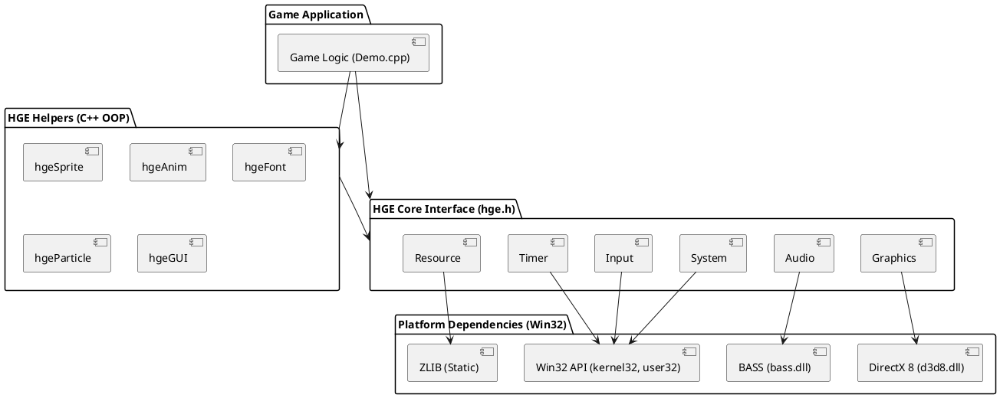

# HGE 架构设计 (System Architecture)

## 🏗️ 整体架构概览 (High-Level Architecture)

HGE (Haaf's Game Engine) 的架构设计采用典型的 **双层抽象模型**，分为 **Core (核心接口层)** 和 **Helpers (高级辅助层)**。这种设计使得底层的硬件交互（如 Windows API、DirectX 8、BASS）被完全隔离在 `HGE` 接口之后，而上层的游戏逻辑可以通过面向对象的方式（如 `hgeSprite`、`hgeAnim`）来快速构建。

## 🧩 核心模块设计 (Core Modules Design)

引擎的核心模块 (`src/core/`) 是一个巨大的单例类 `HGE_Impl`（继承自纯虚接口 `HGE`），它将所有子系统的方法扁平化暴露给开发者，如 `System_Start()`、`Gfx_RenderQuad()`。

### 1. 系统与生命周期管理 (System & Window)
- **底层**: 基于 Win32 API (`CreateWindowEx`, `PeekMessage`)。
- **机制**:
  - `System_Start()` 是整个引擎的驱动入口。它通过一个无限循环 (`for(;;)`) 持续拉取 Windows 消息，并在每一帧调用用户注册的逻辑回调函数 `procFrameFunc` 和渲染回调函数 `procRenderFunc`。
  - **状态管理**: 使用统一的 `System_SetState` 函数配置引擎的所有初始化参数（如窗口大小、是否全屏、是否使用音频等）。

### 2. 硬件加速 2D 渲染 (Graphics)
- **底层**: Direct3D 8。
- **核心机制 (Batching)**: 
  - HGE 不是在调用 `Gfx_RenderQuad` 时立刻绘制图元，而是维护了一个固定大小的全局顶点数组 `VertArray`。
  - 只有当“纹理”或“混合模式”发生改变，或者顶点数组达到容量上限时，引擎才会一次性调用 `DrawPrimitive` 将缓冲区内容提交给 GPU（即所谓的 Batching 批处理）。这极大地提升了 2D 渲染的性能。
- **显存访问**: 通过 `Texture_Lock` 和 `Texture_Unlock` 提供对纹理的底层访问。内部调用 D3D 的 `LockRect`，允许 CPU 直接修改纹理像素。

### 3. 透明资源加载 (Resource)
- **底层**: ZLIB 和 Windows 文件系统 API。
- **机制**: 
  - 支持虚拟文件系统。开发者可以通过 `Resource_AttachPack` 将一个 `.zip` 或改后缀名的压缩包挂载到引擎。
  - 当调用 `Resource_Load` 时，引擎会优先遍历所有挂载的压缩包，如果找到匹配的文件则在内存中解压并返回；如果未找到，则退化为读取磁盘上的物理文件。
  - 这使得游戏发布时可以隐藏资产，而开发期可以直接读取散文件，极大方便了工作流。

### 4. 音频处理 (Audio)
- **底层**: BASS 音频库 (`bass.dll`)。
- **机制**:
  - 为了避免静态链接导致的依赖问题，HGE 在运行时动态加载 `bass.dll`。
  - 提供了三种音频抽象：`Effect` (短促音效，一次加载多次播放)、`Music` (Tracker 格式背景音乐)、`Stream` (流式解码 MP3/OGG，适合长背景音)。

### 5. 输入管理 (Input)
- **底层**: Win32 消息循环。
- **机制**:
  - 在 `WindowProc` 中拦截键盘和鼠标消息。
  - 将操作系统的虚拟键码转化为 HGE 定义的 `hgeInputEvent` 结构，并维护一个事件队列供用户拉取。
  - 同时维护了一个 `keyz` 数组，用于实现 `Input_GetKeyState` 的轮询式输入检测。

## 💡 设计哲学 (Design Philosophy)

1. **零外部依赖 (Zero External Dependencies)**:
   - 开发者在使用 HGE 时，只需要包含 `#include "hge.h"`，无需关注底层的 DX8、ZLIB 或 BASS 头文件。
2. **轻量级 C 风格接口 (Lightweight C-style Interface)**:
   - 核心层暴露的接口全部使用 `CALL` (`__stdcall`) 约定，并且扁平化组织，降低了学习成本。
3. **高层 C++ 封装 (High-level C++ Wrappers)**:
   - 通过 `helpers/` 目录，引擎提供了一套完整的 OOP 解决方案。开发者不需要手动计算四边形的旋转矩阵，只需调用 `hgeSprite::RenderEx(x, y, rot, scale)` 即可，内部自动完成了 2D 坐标系的三角函数计算和矩阵变换。